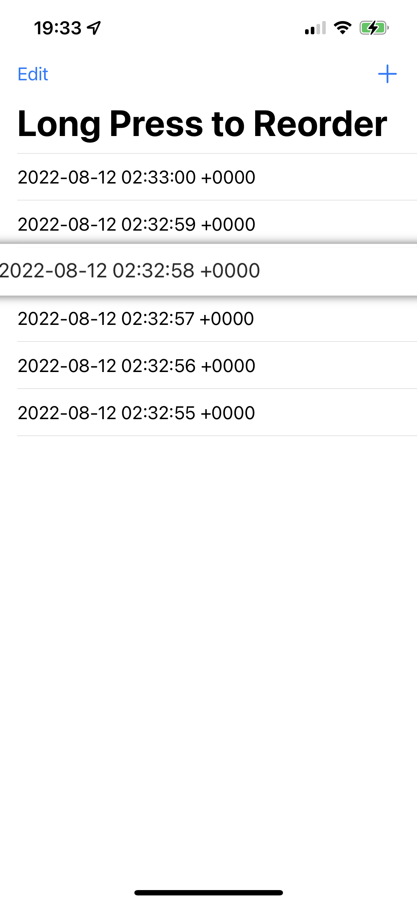

# LPRTableView

LPRTableView (LPR is short for “Long Press to Reorder”) is a drop-in replacement for UITableView and UITableViewController that supports reordering by simply long-pressing on a cell. LPRTableView is written completely in Swift (adapted from Objective-C, original code by: [bvogelzang/BVReorderTableView](https://github.com/bvogelzang/BVReorderTableView)).




## Usage

Simply replace the `UITableView` of your choice with `LPRTableView`, or replace `UITableViewController` with `LPRTableViewController`. _That’s it!_

It’s **important** that you update your data source after the user reorders a cell:

```swift
override func tableView(_ tableView: UITableView, moveRowAt sourceIndexPath: IndexPath, to destinationIndexPath: IndexPath) {
	// Modify this code as needed to support more advanced reordering, such as between sections.
	objects.insert(objects.remove(at: sourceIndexPath.row), at: destinationIndexPath.row)
}
```

It is possible to select which cells can be reordered by implementing the following _optional_ standard `UITableViewDataSource` method (the absence of this method defaults to all cells being reorderable):

```swift
override func tableView(_ tableView: UITableView, canMoveRowAt indexPath: IndexPath) -> Bool {
	// Change this logic to match your needs.
	return (indexPath.section == 0)
}
```

Long-press reordering can be disabled entirely by setting a `Bool` to `lprTableView.longPressReorderEnabled`.

There are also a few _optional_ delegate methods you may implement after setting `lprTableView.longPressReorderDelegate`:

```swift
// Asks the delegate whether a given row can be moved to another location in the table view based on the gesture location.
func tableView(_ tableView: UITableView, shouldMoveRowAtIndexPath indexPath: IndexPath, forDraggingGesture gesture: UILongPressGestureRecognizer) -> Bool

// Provides a chance to modify the cell (visually) before dragging occurs.
//    NOTE: Any changes made here should be reverted in `tableView:cellForRowAtIndexPath:`
//          to avoid accidentally reusing the modifications.
func tableView(_ tableView: UITableView, draggingCell cell: UITableViewCell, atIndexPath indexPath: NSIndexPath) -> UITableViewCell {
	cell.backgroundColor = .green
	return cell
}

// Called within an animation block when the dragging view is about to show.
func tableView(_ tableView: UITableView, showDraggingView view: UIView, at indexPath: NSIndexPath)

// Called within an animation block when the dragging view is about to hide.
func tableView(_ tableView: UITableView, hideDraggingView view: UIView, at indexPath: NSIndexPath)

// Called when the dragging gesture's vertical location changes.
func tableView(_ tableView: UITableView, draggingGestureChanged gesture: UILongPressGestureRecognizer)
```

See the ReorderTest demo project included in this repository for a working example of the project, including the code above.

If you’re replacing `UITableViewController` with `LPRTableViewController` and are using a custom `UITableViewCell` subclass, then you must override `registerClasses()` and register the appropriate table view cell class(es) within this method. **Do not** call `super` within this method.

```swift
override func registerClasses() {
	tableView.register(MyCustomTableViewCell.self, forCellReuseIdentifier: "Cell")
}
```


## Requirements

Since LPRTableView is written in Swift 5, it requires Xcode 10.2 or above and works on iOS 12 and above.


## License

LPRTableView is released under the MIT License.
